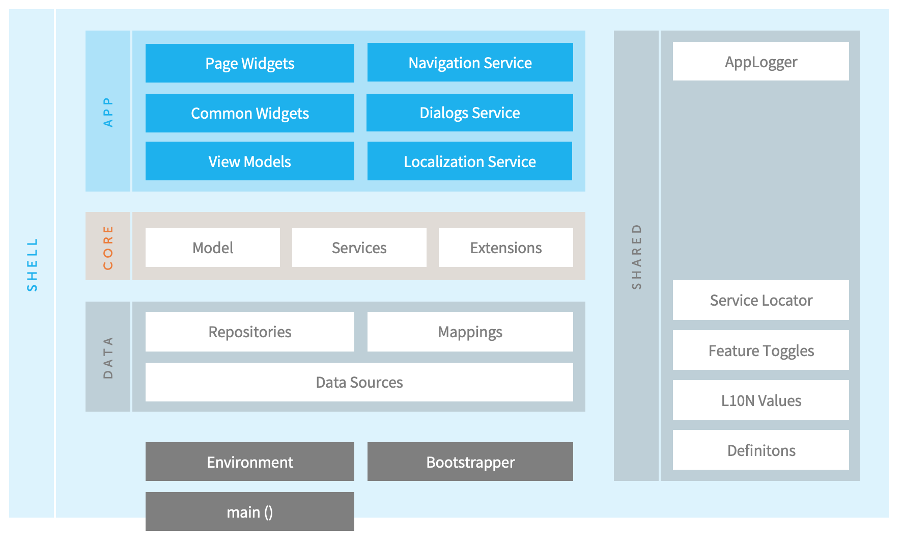

# Vocabulary Advancer

The Vocabulary Advancer app's first purpose is apparently to assist in settlement of advanced vocabulary with phrase cards... which should be reviewed at appropriate intervals. So, this is an another one mobile app for words memorization. 

The trick is, its main purpose is not just that. This repository serves the **Flutter Starter App** baseline solution, showcasing the initial project setup and helping to minimize the gap between hello-world-tutorials and a production ready Flutter app.

## Flutter Starter app

[Flutter](https://flutter.dev/) as the UI toolkit over [Dart Platform](https://dart.dev/platforms) already proved its viability and great advantages to build nicely looking mobile apps. Apart from the app consumer perspectives, it brings lovely development experience as well.

The flexibility in code decomposition, wide range of community-driven packages, different approaches in UI state management and widget lookups give the power to developers but may bring a sort of confusion for learners. 

This app is actually one of many examples which help to settle a minimal set of technical decisions for a Flutter app from scratch. So the actual goals are:

* Define a baseline example solution for my team mentees and Flutter learners
* Standardize our infrastructural approaches for new Flutter apps and express them in this Starter App
* Use as an accelerator to speed up new own projects 

## What's included

1. Overall decomposition of app architectural layers and segregation of concerns, such as:
    * Presentation
    * Presentation Logic
    * Business Logic
    * Data access and mapping
    * Cross-cutting
    * Dependency Resolution
    * Bootstrapping
    * Mocks
2. Application and Dependency registry initialization
3. Environment Flavours (DEV vs QA vs PROD, etc.)
4. Feature Toggles (opt-in functionalty)
5. Centralized and strongly typed Navigation service
6. Centralized Dialog service
7. Model validation 
8. Application themes 
9. Localization
10. Unit tests
11. Code analysis enforced

## How to start

1. If not yet, ensure Flutter SDK is installed correctly, visit https://flutter.dev/docs/get-started/install for details.
2. If not yet, add a Flutter plugin to your IDE. Supported: **Android Studio**, **VS Code**, **IntelliJ IDEA**. Review instructions: https://flutter.dev/docs/development/tools
3. Git clone this repository, ``git clone https://github.com/kugjo/va.git``
4. Stay on the **master** branch
5. Fetch dependent Dart/Flutter packages, ``flutter pub get``
6. If needed by your IDE, add a new Build Configuration with **./src/lib/main.dart** Flutter app entry point
7. Run on a selected device/emulator

## Architecture

From high perspective, the following code decomposition was considered for this Starter App:

## LICENSE

MIT License

              

